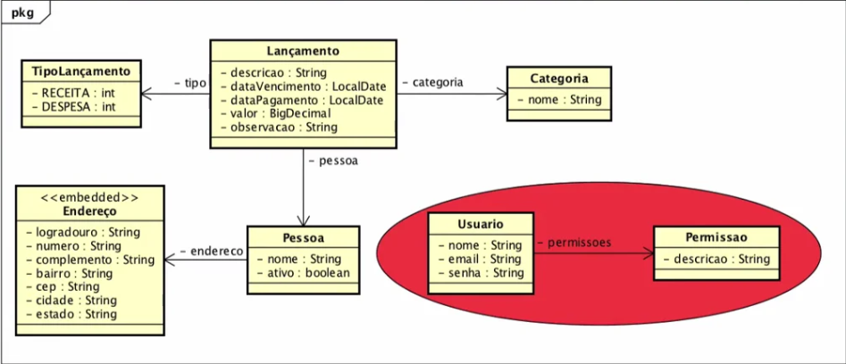

# Money-Api 

Projeto criado a partir do curso Fullstack Angular e Spring da algaworks 


## Tecnologias usadas no curso para o desenvolvimento:
 - Java
 - Spring boot
- Spring Data 
 - Flyway
 - MySql
	
## Tecnologias adicionadas por mim:
 - Lombok 
 
## Diagrama de classe do projeto
 
 
	

```
User Story
Título: Recuperação de Crédito de Clientes Inadimplentes

Como: Gerente de crédito de um banco
Eu quero: automatizar o processo de recuperação de crédito
Para que: eu possa aumentar a taxa de recuperação e reduzir perdas financeiras

Cenários de Comportamento Dirigido por Testes (BDD)
Cenário 1: Identificação de Clientes Inadimplentes
Dado que um cliente possui pagamentos atrasados por mais de 30 dias
E o sistema possui informações atualizadas sobre o histórico de pagamento do cliente
Quando o sistema verifica o status de pagamento
Então o sistema deve marcar o cliente como inadimplente

Cenário 2: Notificação de Inadimplência
Dado que um cliente foi marcado como inadimplente
Quando o sistema detecta a mudança de status para inadimplente
Então o sistema deve enviar uma notificação ao cliente via e-mail e SMS informando sobre a inadimplência
E incluir informações sobre as consequências da inadimplência e instruções para regularização

Cenário 3: Oferecer Plano de Renegociação
Dado que um cliente foi notificado sobre a sua inadimplência
E o cliente não regularizou a dívida em 15 dias
Quando o sistema verifica a ausência de pagamento após o prazo de notificação
Então o sistema deve gerar uma proposta automática de renegociação da dívida
E enviar a proposta ao cliente via e-mail e SMS

Cenário 4: Aceitação da Renegociação
Dado que um cliente recebeu uma proposta de renegociação
Quando o cliente aceita a proposta de renegociação através do portal online
Então o sistema deve atualizar o status do cliente para "em renegociação"
E enviar um contrato de renegociação para o cliente assinar eletronicamente

Cenário 5: Monitoramento de Pagamentos da Renegociação
Dado que um cliente está em um plano de renegociação
E possui pagamentos mensais a serem feitos conforme o contrato de renegociação
Quando a data de vencimento de um pagamento se aproxima
Então o sistema deve enviar lembretes ao cliente via e-mail e SMS 5 dias antes do vencimento
E deve atualizar o status do pagamento assim que ele for realizado
```


    @Test
    fun `deve marcar cliente como inadimplente se pagamento estiver atrasado mais de 30 dias`() {
        // Dado
        val cliente = Cliente(id = 1, email = "cliente@exemplo.com", numeroTelefone = "1234567890", inadimplente = false, ultimaDataDePagamento = LocalDate.now().minusDays(31))
        `when`(clienteRepository.findById(1)).thenReturn(Optional.of(cliente))

        // Quando
        creditoService.verificarStatusDePagamento(1)

        // Então
        assertEquals(true, cliente.inadimplente)
    }


    step 2

     fun verificarStatusDePagamento(clienteId: Long) {
        val cliente = clienteRepository.findById(clienteId)
            .orElseThrow { RuntimeException("Cliente não encontrado") }

        if (cliente.ultimaDataDePagamento.isBefore(LocalDate.now().minusDays(30))) {
            cliente.inadimplente = true
            clienteRepository.save(cliente)
        }
    }


    step 3

    fun verificarStatusDePagamento(clienteId: Long) {
        val cliente = clienteRepository.findById(clienteId)
            .orElseThrow { RuntimeException("Cliente não encontrado") }

        if (estaAtrasadoMaisDe30Dias(cliente.ultimaDataDePagamento)) {
            cliente.inadimplente = true
            clienteRepository.save(cliente)
        }
    }

    private fun estaAtrasadoMaisDe30Dias(dataDePagamento: LocalDate): Boolean {
        return dataDePagamento.isBefore(LocalDate.now().minusDays(30))
    }
